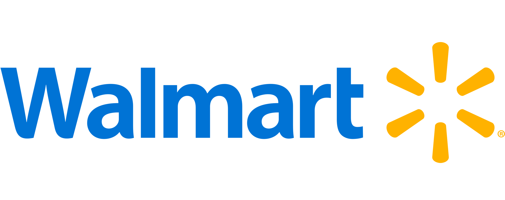
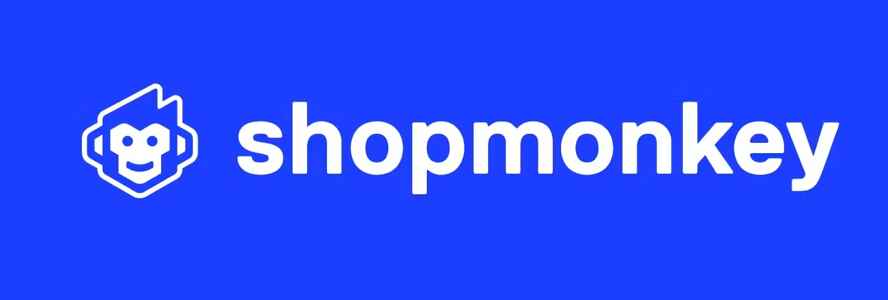
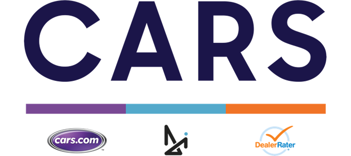
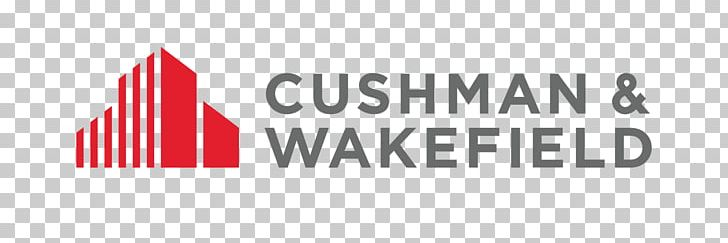
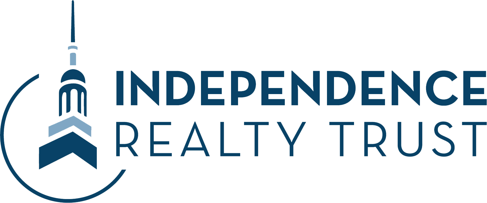

# Hello 👋🏻 I'm **Oscar Gallo**

**Full Stack Engineer | AI Entrepreneur | Mentor**

  
  
  

---

## What I'm Working On

### **ByPosting** – Co-Founder

<a href="https://byposting.com" target="_blank">byposting.com</a>

- AI-native community manager that automatically creates, designs, and publishes social media content across multiple platforms.

### **ByRenovate** – Co-Founder

<a href="https://byrenovate.com" target="_blank">byrenovate.com</a>

- AI-native interior design & renovation platform.
- Aimed at helping real estate developers, entrepreneurs and real estate agents navigate the fast-changing tech ecosystem.

### **Oscar Codes Life** – Creator

<a href="https://oscarcodeslife.com" target="_blank">oscarcodeslife.com</a>

- Personal knowledge hub where I share insights about **AI, web development, mobile development, books, and more**.
- Aimed at helping developers and entrepreneurs navigate the fast-changing tech ecosystem.

### **Iteris** – Creator

<a href="https://github.com/Oscar-Codes-Life/Iteris" target="_blank">github.com/Oscar-Codes-Life/Iteris</a>

- Autonomous software engineering agent that automatically implements GitHub issues and Trello cards by spawning Claude Code instances and opening pull requests.

### **nextjs-geo-audit** – Creator

<a href="https://github.com/Oscar-Codes-Life/nextjs-geo-audit" target="_blank">github.com/Oscar-Codes-Life/nextjs-geo-audit</a>

- Claude Code skill that performs technical SEO and generative engine optimization audits on Next.js App Router codebases.

---

## Services

### **Fractional CTO Call**

<a href="https://cal.com/oscar-gallo/fractional-cto-call" target="_blank">Book a Fractional CTO Call</a>

- Strategic technology leadership for startups and growing teams — architecture reviews, tech stack decisions, and engineering roadmaps.

### **AI Systems Architect**

<a href="https://cal.com/oscar-gallo/ai-systems-architect" target="_blank">Book an AI Systems Architect Session</a>

- Design and plan AI-powered systems for your product — from LLM integrations and agent workflows to infrastructure and deployment strategy.

### **Discovery 30 Min Meeting**

<a href="https://cal.com/oscar-gallo/30min" target="_blank">Book a 30 Min Discovery Call</a>

- Quick introductory call to discuss your project, explore how I can help, and determine the best path forward.

---

## Experience

### **ShopMonkey.io** – Mobile React Native Engineer

_May 2024 – Present_

- Developing and maintaining mobile applications for the automotive repair management platform.
- Focused on improving user experience, performance, and scalability for repair shops.
- **Tech:** React Native, TypeScript, Expo, State Management Libraries, API Integrations.

---

### **IRT Living** – Consultant Full Stack Engineer

_May 2020 – Dec 2022_

- Built a web app to sort and manage invoices and purchase orders, preventing invoice phishing.
- Developed a mobile app for property inspections, managing property statuses and issues.
- **Tech:** React, React Native, Next.js, REST APIs, Redux, TypeScript, CSS, HTML5.

---

### **Results Inc** – Consultant Full Stack Engineer

_Jan 2020 – Feb 2022_

- Built a mobile app to manage BLE-connected kitchenware, tracking cooking levels for multiple devices.
- Supported three device types with different combinations of Bluetooth, screens, and Wi-Fi.
- **Tech:** React, React Native, Next.js, Redux, TypeScript, Architecture Design.

---

### **Cars.com** – Consultant Frontend Engineer

_Nov 2020 – Jun 2021_

- Created **Epiphany**, a custom front-end framework based on Web Components and TypeScript.
- Built a complete design system including text fields, buttons, accordions, and more.
- **Tech:** TypeScript, LitElement, Web Components, LESS, SASS.

---

### **Few.io** – Full Stack Engineer

_Aug 2018 – Nov 2020_

- Coordinated with design and engineering to translate client requirements into software.
- Projects launched:
  - **Few.io v2 and v3** – company websites.
  - **Fit Body App by Anna Victoria** – a mobile fitness application.
- **Tech:** React, React Native, Next.js, Gatsby, Redux, TypeScript, Figma, Zeplin.

---

<h2>🚀 I build AI + Web + Mobile solutions for businesses like:</h2>

  
  
  
  
  
  

---

## About Me

I am a software engineer and founder with 10+ years of experience building mobile and mobile-first web applications. I specialize in **JavaScript, TypeScript, React, React Native, Next.js, Generative AI, AI Agents, and Node.js**, and modern web architectures.

I bridge the gap between design, engineering, and business goals, turning complex requirements into working products. My work spans **healthcare, retail, automotive, and AI-driven platforms**.

---

## My tech Stack:

  
  
  
  
  

  
  
  
  
  
  
  
  
  
  
  
  
  
  

## Entrepreneurship & Side Projects

### **DG42** – Co-Founder / CTO

[bydg42.com](https://bydg42.com)
_2023 – Present_

- Building AI-first products in the fields of marketing, design, and product photography.
- Leading fast-paced MVP development, launching products in **9-day challenges**.
- Focused on making AI accessible for non-technical users through modular assistants and creative tools.

### **Mentoring**

_2019 – Present_

- Mentor students, new graduates, and career changers in web and mobile development.
- Special focus on helping people with strong passion and resilience break into the software industry.

---

## Skills

- **AI & ML:** AI infrastructure, OpenAI API, AI image generation, Large Language Models (LLMs)
- **Backend & Databases:** Node.js, Next.js, DrizzleORM, Prisma, PostgreSQL, Convex, Firebase.
- **Frontend & Mobile:** React, React Native (Expo), Next.js, Gatsby
- **State Management:** Redux, Zustand, React Query
- **Languages:** TypeScript, JavaScript
- **UI & Styling:** Tailwind, CSS, LESS, SASS
- **Other:** Leadership, Architecture Design, Product Strategy, Mentorship

---
